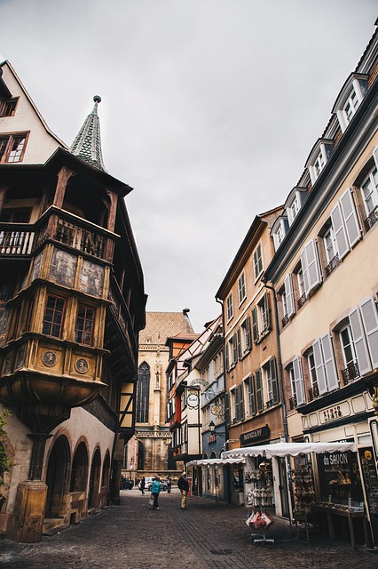
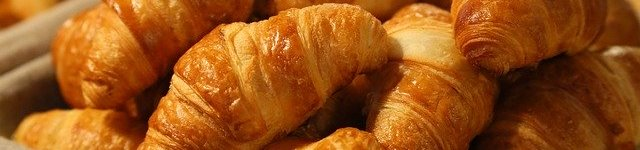

    <h1>Designelement kmom06</h1>
    
De designelement jag har valt att jobba med:

    <ul>
        <li>Prespektiv</li>
        <li>Balans</li>
        <li>Proportion</li>
        <li>Hierarki</li>
        <li>Variation</li>
    </ul>
    

        

            <h1>France.</h1>
            
Liberté Égalité Fraternité

        

        
    

    

        

            <h2>Visit.</h2>
        

        

            <h2>More.</h2>
        

    

    

        
        

            <h2>Croissant.</h2>
            
Try our signature whilst here

        

    

